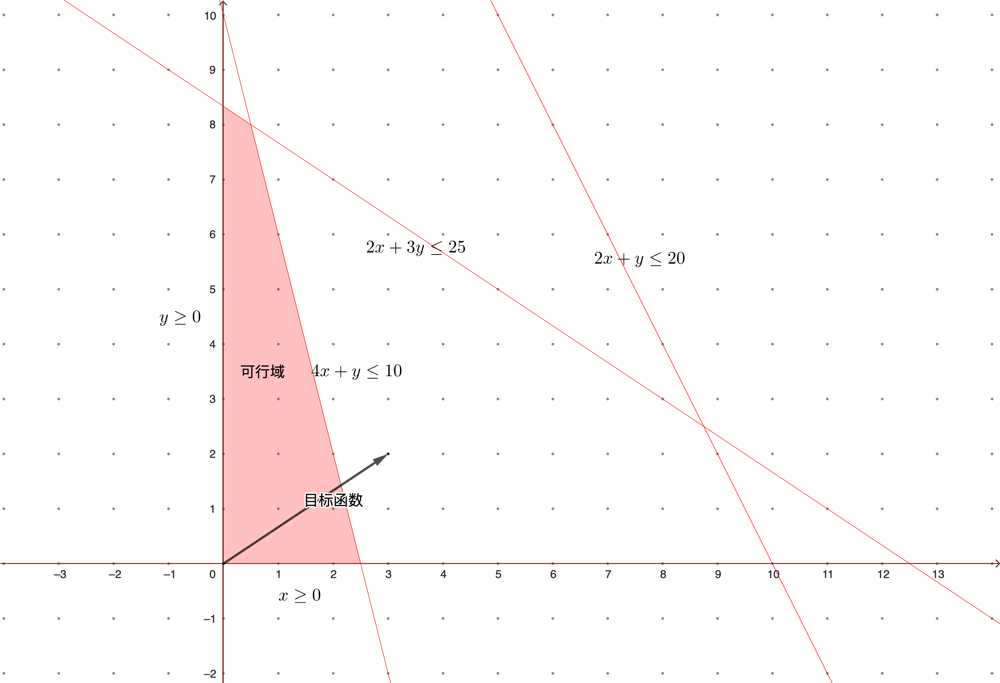

####  线性规划基础概念 

___线性规划 (Linear Programming)___ 一般来讲, 一个数学规划模型包含目标函数, 约束条件和决策变量三部分. 当数学规划模型的目标函数和约束条件的左端均为线性表达式, 且决策变量为连续变量时, 该模型被称为线性规划. 线性规划问题通常用标准型表达为:

$$
\begin{aligned}
max \quad & c^{T}x \\
s.t \quad & Ax = b\\
\quad & x \geq 0
\end{aligned}
$$

其中 $c\in \mathbb{R}^{n \times 1}$, $x\in \mathbb{R}^{n \times 1}$, $A\in \mathbb{R}^{m \times n}$, $b\in \mathbb{R}^{m \times 1}$. 下面展示了一个线性规划的实例:

__例 (生产安排)__ 某厂在计划期间内要生产A, B两种产品, 需要用到机器, 人工和原材料. 已知生产单位产品的利润与所需各种资源的消耗量如下图所示, 请问应如何安排生产能是使该厂获利最大? <u>_(最优解为 (x1, x2) = (0.5, 8), 对应的总利润为17.5)_</u>

|   | 产品A  |  产品B   | 资源限额  |
| :-----| ----: | :----: |:----: |
|  机器 | 4 |  1  |  10工时 |
| 人工 | 2 |  3  | 25工时  |
| 原材料 | 2 |  1  | 20公斤  |
|  单位利润 (元) | 3 |  2  |  |

 

__定理__ 假设从 $A$ 的 $n$ 列中选择出 $m$ 个线性无关的列 (如果A的秩为m，则这样的集合存在). 为了简化符号，假设我们选择 $A$ 的前 $m$ 列，并将由这些列确定的 $m\times m$ 矩阵记为 $B$. 矩阵B是非奇异的, 我们可以唯一地解出方程: $Bx_{B}=b$ 或 $x_{B}=B^{−1}b$. 通过设置$x=(x_{B},0)$, 我们可以得到$Ax = b$的一个解, 我们称之为 ___基解 (Basic Solution)___. 当 $B^{−1}b \geq 0$ 时, 我们称之为 ___基可行解 (Basic Feasible Solution)___

__定理__ 如果一个线性规划问题的可行域非空, 则其可行域 $D = \{X|\forall i = 1,2,...,m,\ \sum_{j=1}^{n}a_{ij}x_{j} = b_{j},\ x_{j}\geq 0\}$ 是凸集

__定理__ 如果线性规划问题的可行域有界, 则其最优解必可在某个顶点处获得

__定理__ 线性规划问题的顶点就是一个基可行解
