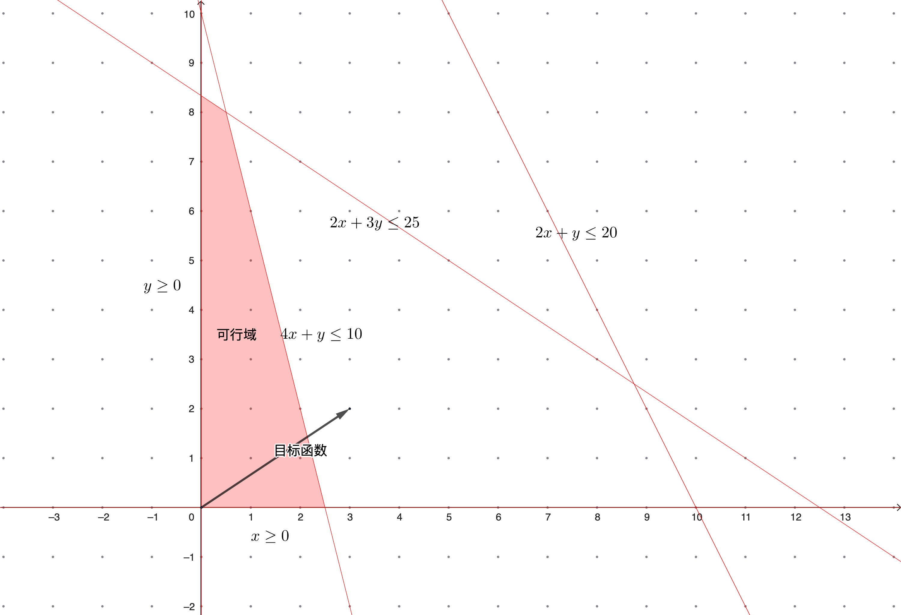

# 线性规划基础概念

_<mark style="color:green;">**线性规划 (Linear Programming)**</mark>_ 一般来讲, 一个数学规划模型包含目标函数, 约束条件和决策变量三部分. 当数学规划模型的目标函数和约束条件的左端均为线性表达式, 且决策变量为连续变量时, 该模型被称为线性规划. 线性规划问题通常用标准型表达为:

$$
\begin{aligned}
max \quad & c^{T}x \\
s.t \quad & Ax = b\\
\quad & x \geq 0
\end{aligned}
$$

其中 $$c\in \mathbb{R}^{n\times 1}$$, $$x\in \mathbb{R}^{n\times 1}$$, $$A\in \mathbb{R}^{m\times n}$$, $$b\in \mathbb{R}^{m+1}$$. 下面展示了一个线性规划的实例:

<mark style="color:green;">**例 (生产安排)**</mark> 某厂在计划期间内要生产A, B两种产品, 需要用到机器, 人工和原材料. 已知生产单位产品的利润与所需各种资源的消耗量如下图所示, 请问应如何安排生产能是使该厂获利最大? _(最优解为 (x1, x2) = (0.5, 8), 对应的总利润为17.5)_

|          | 产品A | 产品B | 资源限额 |
| -------- | --: | :-: | :--: |
| 机器       |   4 |  1  | 10工时 |
| 人工       |   2 |  3  | 25工时 |
| 原材料      |   2 |  1  | 20公斤 |
| 单位利润 (元) |   3 |  2  |      |

<figure><figcaption></figcaption></figure>

<mark style="color:green;">**定理**</mark> 假设从 $$A$$ 的 $$n$$ 列中选择出 $$m$$ 个线性无关的列 (如果 $$A$$ 的秩为 $$m$$，则这样的集合存在). 为了简化符号，假设我们选择 $$A$$ 的前 $$m$$ 列，并将由这些列确定的 $$m\times m$$ 矩阵记为 $$B$$. 矩阵 $$B$$ 是非奇异的, 我们可以唯一地解出方程: $$Bx_{B}=b$$ 或 $$x_{B}=B^{−1}b$$. 通过设置 $$x=(x_{B},0)$$, 我们可以得到 $$Ax = b$$ 的一个解, 我们称之为 _**基解 (Basic Solution)**_. 当 $$B^{−1}b \geq 0$$ 时, 我们称之为 _**基可行解 (Basic Feasible Solution)**_

<mark style="color:green;">**定理**</mark> 如果一个线性规划问题的可行域非空, 则其可行域 $$D = \{X|\forall i = 1,2,...,m,\ \sum_{j=1}^{n}a_{ij}x_{j} = b_{j},\ x_{j}\geq 0\}$$是凸集

<mark style="color:green;">**定理**</mark> 如果线性规划问题的可行域有界, 则其最优解必可在某个顶点处获得

<mark style="color:green;">**定理**</mark> 线性规划问题的顶点就是一个基可行解
